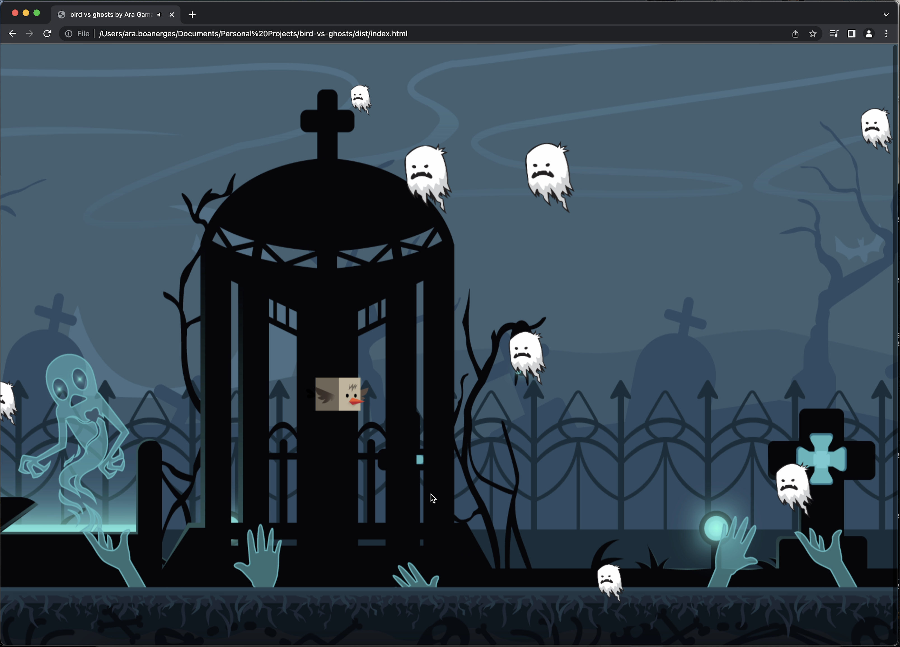

### Bird vs Ghost by Ara Gamaliel

A simple JavaScript game created using vanila JavaScript compiled using Webpack

To run this:

1. Clone this repo
2. Run `npm install` to install all dependencies
3. RUn `npm run dev` to run this game on your local. The port is in `localhost:8000`
4. To compile this game, run command `npm run build`

Hope you enjoy this game! Hopefully you are not afraid of ghost👻
